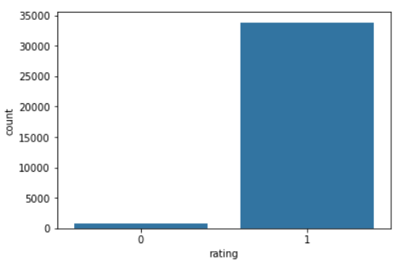
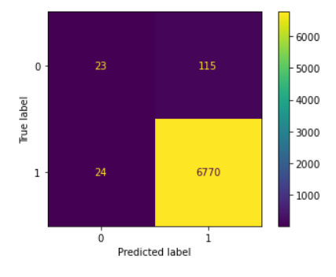
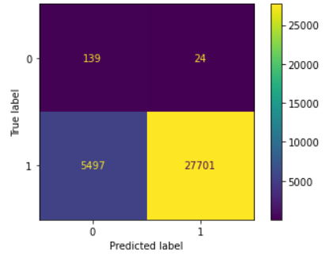
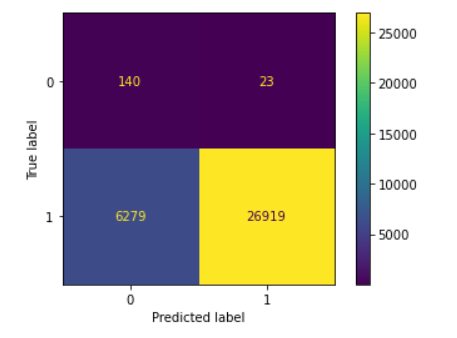

# NLP-Text-Classification
This is my implementation for an assignment in the NLP course taught in Zewail City. It is a text classification task using Bags of words. I used Naive Bayes Model. I also tried different feature engineering approaches.

## Text bianry Classification using Naive Bayes Classifier

In this task, we are required to classify text, as part of a polarity sentiment analysis (positive or negative sentiment)

## Dataset issues:
After checking for null and duplicate values, I found that the data was **extremely unbalanced**, with the negative sentiment examples forming 2.3% of the data. 

  

This means that a blind classifier that always predicts the sentiment to be positive will yield an accuracy of 97.7% ! So,
* Obviously, accuracy is **not a suitable metric**. 
* Instead, I used the **balanced accuracy** which averages the accuracy of classification between classes.
* I also used the confusion matrix as a visual cue to what is going on.

## Approach:
I iteratively developed 3 models

# Model 1
* First, I split the data into training and test sets, with a test size = 0.2
* I used the `CountVectorizer` from sklearn to create the matrix associated with the bags of words for all training set documents.
* I also found that the `CountVectorizer` takes numbers and words that start with numbers into consideration. As such, I fed a regex to the `CountVectorizer` to only take words that are at least 3 characters long, and do not have any numbers.
* After fitting the CountVectorizer to the training data, I used it to Transform the test data into bags of words.
* Then I used a Naive Bayes classifier, fit it to training data, and tested its performance on the test data

#### Performance:
Although the model gave a very good accuracy, we shouldn't be tricked by this, because the data itself is unbalanced
Due to the huge imbalance, the model performed very poorly with negative sentiment examples, correctly classifying **only 23 out of 138 negatives in the test data**. The `balanced  accuracy was nearly 58%`

This is the confusion matrix:

# Model 2: Handle imbalance
All the previous steps were the same, except for how I decided the training and testing sets. What is different in this step is:
* Separating the positive and negative ratings into 2 dataframes
* Choose like 80% of the negative reviews, as training data `(X1,Y1)`. The other 20% are testing data `(X1T, Y1T)`
* From the positive reviews choose an equal number of rows for the training data `(X2, Y2)`. The rest are added to the testing data `(X2T, Y2T)`
* This way, our training dataset is balanced `(X1 + X2, Y1 + Y2)`, where the plus here means concatenating

Hence, we train the model on balanced data, sacrificing most of the training data for balance.

#### Performance:
The True positives indeed decreased, but the true negatives are the majority of truth negatives. The `balanced accuracy is nearly 81%`

# Model 3:
What motivated me for the third model is believing that adjectives, verbs are the determining factors of a sentiment, and that other words represented noise. For that I:
* Performed preprocessing over the data, where I filtered words that are either adjectives, verbs, or adverbs, based on their POS tag
* Discarded words that included typos
* Trained the model on a balanced dataset
#### Performance
It turned out that this model actually performed worse 

Here is the confusion matrix:

# Conclusion
For binary classification of sentiment polarity detection, we tried using Bag of words assumption and a Naive Bayes classifier. The model performance was hindered by the data imbalance. For that, I tried different approaches to make the model work better. These approaches were 
* training the model on a balanced subset of the data
* Same as above, in addition to filtering only adjectives, verbs and adverbs.

In the end, the best iteration was the one where I used the balanced subset, without any filtering. 

There is also a possibility that I did not explore, which is handling negation. I know that we can append NOT to each word up to the nearest delimiter. However, I don't know how to do this in code.
